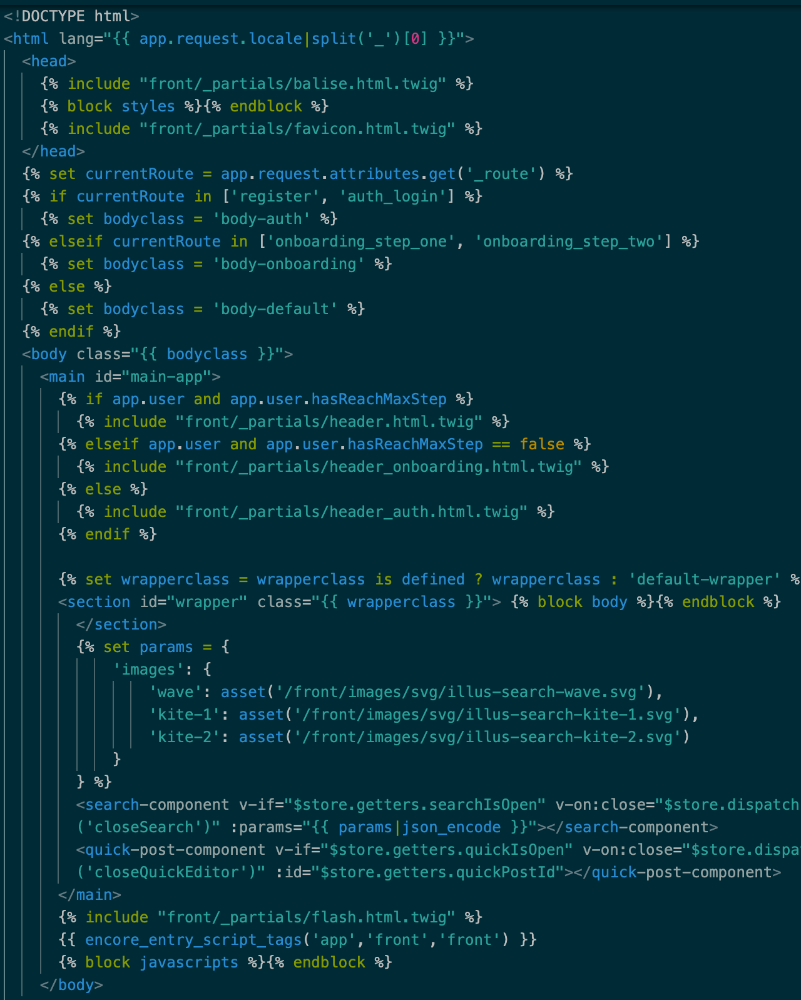
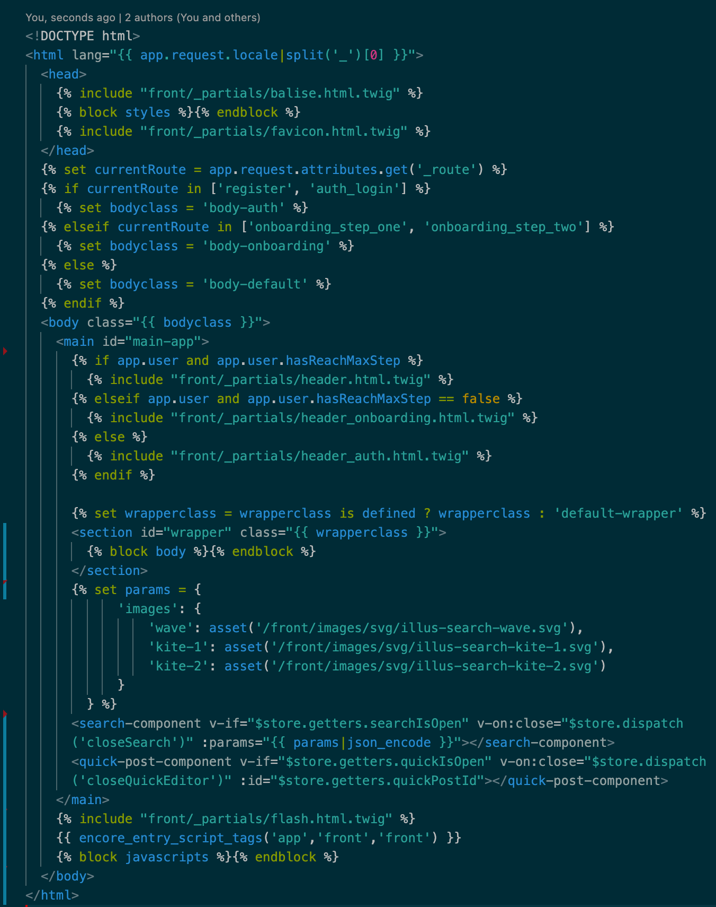

# vstwig

Includes syntax highlighting for the Twig language, and an opinionated formatter that actually works. The formatter formats a document containing HTML tags, `{{ ... }}`, and ` ... `, leaving the code between `` and `` untouched. There are no configuration options, and the formatter respects the current VSCode configuration.

Before:

After:

